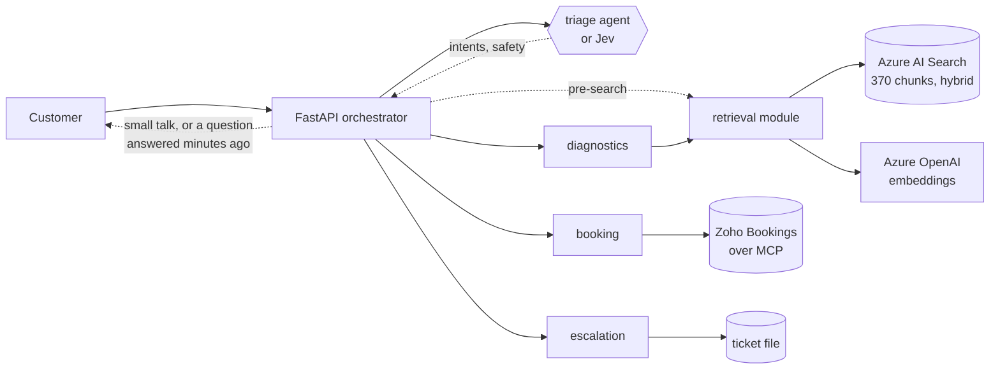

# AutoAssist

A multi-agent vehicle service assistant on Azure AI Foundry.

Ask it about a fault code and it answers from the workshop's service documents,
with citations. Ask it to book a slot and it checks real availability. Ask about
something the documents do not cover and it says so instead of guessing.

```
> P0420 is showing, can I book in for Saturday?

The P0420 fault code means the catalytic converter on bank 1 is not cleaning
the exhaust as well as it should... (fault code list, P0420)

I can help you book a slot for Saturday 19 September. Here are some available
times: 09:00, 10:30, 12:00, or 14:00. Could you please provide your vehicle
registration number?

triage → diagnostics → booking · searched documents · 7,071 tokens · 11.9s
```

> Live on Azure Container Apps. Working: retrieval, four agents, routing by the
> triage agent or by Jev, parallel specialists, a streaming chat page, bookings
> in Zoho Bookings, keys in Key Vault, CI and a deploy with verified rollback,
> App Insights tracing, automated evals (19/20).
> Not yet: model-graded evaluation, authentication on /chat. See [Status](#status).

---

## How it works



Before any model runs, the orchestrator answers pleasantries itself and serves a
first-message question it answered in the last ten minutes from an answer cache
(plain fault-code answers only - never a booking or anything safety-flagged).

Everything else goes to **triage**, which returns intents, a safety flag and any
registration it spotted. Triage is either the triage agent writing JSON or Jev,
a classifier returning four probabilities (`TRIAGE_BACKEND`; the live app runs
Jev, and falls back to the agent for anything Jev cannot answer). A first
message about a fault code, with no booking or safety words in it, skips triage
altogether. The orchestrator reads the decision and picks the specialists; when
diagnostics is one of them it searches the library first and hands the results
over with the question. Independent specialists run at once, each in its own
fresh thread, and their answers are joined into one reply.

**Routing is code, not an agent calling agents.** Three reasons: every decision
is a logged value rather than a hidden step inside a model; the routing logic is
unit tested without touching Azure; and the rule "a safety issue always reaches
escalation" is an `if` statement. Findings 1, 6 and 7 below are all cases of a
model dropping a safety rule under pressure from competing instructions. An `if`
statement does not do that.

There is a second safety net. Triage decides whether a message is dangerous, and
a regex checks the raw text independently. Either firing is enough. When the
regex catches something triage missed, it logs a warning — a signal the triage
prompt needs work, captured automatically.

### Jev or the LLM, side by side

Above the message box on the chat page is **Triage: Jev | LLM** and **Compare
both**.

- **Left alone**, the page sends `auto` and the server's `TRIAGE_BACKEND`
  decides, exactly as before; the lit segment, marked *default*, is that one.
- **Pick the other one** and it classifies your messages only. The choice is
  remembered in your browser. Jev needs a TypeSafe key on the server: without
  one, picking Jev gets the LLM, and the panel, the step list and the reply's
  tags all say so rather than showing the LLM's route under Jev's name.
- **Compare both** has the other classifier read the same message too, beside
  the answer. A card in the panel puts the two side by side: each one's own
  route and safety call (Jev's four probabilities, the LLM's intents as parsed
  from its JSON), what the keyword net matched and what it added, the route
  decided, latency, tokens, and cost at the prices the routing eval uses
  (finding 16). Rows where they disagree are highlighted, before the keyword net
  and after it. When Jev was picked and cannot answer, the LLM routes the
  message and the card shows Jev as not answering: the LLM is never compared
  with itself, and its triage turn is paid for once.

Try **Brake fluid interval**. Jev reads it as a maintenance question and scores
it low on safety; the keyword net sees "brake" and escalates it anyway. The card
shows both halves of that — which is the argument for keeping the net.

The comparison is display only. The route, the reply, any ticket and the answer
cache follow the classifier that routed the message; a compare request neither
reads nor fills the cache, and its tokens are counted apart, per classifier
(`compare_tokens_jev` and `compare_tokens_agent` in `/metrics`), not in the
answer's. If the other classifier fails or is still running when the answer is
ready, the card says so and the answer is unaffected. Small talk, a bare fault
code and a cached answer involve no classifier, so the toggle does not apply to
them and the panel says that instead.

The same is available without the page: `POST /chat` with `"triage": "jev"`
(or `"agent"`, or `"auto"`) and `"compare": true`; the response carries
`triage` (what was asked for, what was used and why) and `comparison`.

### The agents

| Agent | Job | Tools |
|---|---|---|
| triage | Classify intent, flag safety. Returns JSON, never prose. | none |
| diagnostics | Fault codes, warning lights, maintenance intervals | `search_service_docs` |
| booking | Find, book, move, cancel and confirm slots, in Zoho Bookings | `get_available_slots`, `book_service_slot`, `move_service_booking`, `cancel_service_booking`, `look_up_booking` |
| escalation | Hand over to a human with a written summary | `raise_ticket` |

### Retrieval

Hybrid search — BM25 keyword plus vector similarity, fused by reciprocal rank
fusion — over 370 chunks: 63 OBD-II fault codes, 28 maintenance items, and 279
chunks of 30 synthetic service bulletins.

Two things sit on top of the raw search:

**A relevance floor.** Top-k retrieval always returns k results, even when
nothing is relevant — there is no empty result. Below the floor we return
nothing at all and tell the agent the library does not cover it.

**A per-source cap.** One strongly matching document can take every slot. For
"my catalytic converter light is on", four of five results came from one
bulletin and pushed the actual P0420 definition to rank 4.

The agents do not use Azure AI Search's built-in tool. Retrieval is a **function
tool** this service executes, which is what allows the floor, the cap, and
control over how citations are worded. (It was also forced by a bug — see
finding 5.)

**No SDKs in the running service.** It calls Foundry, AI Search and Azure
OpenAI directly over HTTPS: eleven requests, reproduced from the SDKs' recorded
traffic and checked against the live system. `azure-identity` still handles
sign-in. The image installs only what the service imports
(`requirements-service.txt`). See [docs/decisions/007-plain-azure-apis.md](docs/decisions/007-plain-azure-apis.md).

---

## What this is actually for

The system works, but the interesting part is
**[docs/evaluation.md](docs/evaluation.md)** — sixteen numbered findings: what
went wrong or was measured, why, and what changed. Short version:

1. **The agent skipped retrieval on safety questions.** A rule that only forbids
   leaves the model to invent its own replacement behaviour.
2. **It cited a clutch bulletin to answer a brake question.** Worse than
   answering from nothing, because it read as properly sourced.
3. **Testing several questions in one thread invalidated the results.** The
   model reused chunks already in the history instead of searching again.
4. **The portal and the repo held different prompts.** Deploying from the repo
   silently reverted a fix and produced a fabricated citation.
5. **The built-in search tool could not do vector queries here.** Which is why
   retrieval moved into this service.
6. **A safety warning vanished when two instructions overlapped.** The model
   resolved the ambiguity in the unsafe direction.
7. **A tool's output is a second prompt, and it wins.** Saying "5 relevant
   documents" when the tool only knew "5 closest text matches" overrode the
   instruction to check relevance. So did the word "complete".
8. **A missing run state caused 90-second hangs.** Azure returns `incomplete`;
   the poll loop did not know it and waited out the timeout on runs that had
   already finished. Found by an eval case about prompt injection.
9. **"I can smell petrol" did not trigger the fuel warning.** The prompt said
   "fuel leaks". Customers do not say "leak".
10. **The scorer was wrong more often than the system.** Six of the first ten
    eval failures were bugs in the eval, including checking citations against
    files on disk when the search index is the real ground truth.
11. **A plausible wrong document beat the safety warning.** A calm bulletin
    saying spongy brakes are normal was repeated, with a citation. Now code
    withholds reassurance on a safety-flagged message.
12. **A booking reference was a key to someone else's booking.** Looking up,
    moving and cancelling now need the registration too.
13. **A blanket safety warning on a question that was not about safety.** "Do
    not drive" above "safe to drive with care" for P0420, and the warning in
    the history then raised a ticket on the next turn.
14. **Triage had never been measured.** A labelled routing set showed it
    dropping diagnostics on safety messages.
15. **Half of triage's mistakes were one ambiguous sentence.** "Include" read
    as "replace"; one rewrite took routing from 45/72 to 52/72.
16. **A classifier beat the chat model at classifying - by less than first
    reported.** With the keyword backstops applied to both, as production does,
    Jev routed 57/72 right against 52/72, with six safety false alarms against
    seven, in 352ms against 2,118ms, at a sixth of the cost. The first table
    left the backstops off Jev's side only and said 63/72 and two. It is now a
    switch, the live app uses it, and the page can show both side by side.

Almost none of them looked broken: most produced a plausible, well-written
answer. They were found by checking whether the tool was actually called, what
the citation pointed at, and whether the test conditions were clean.

---

## Running it

### Azure resources

| Resource | Purpose | Tier |
|---|---|---|
| AI Foundry project `autoassist` | hosts the agents | — |
| `gpt-4.1-mini` | all four agents | Global Standard |
| `text-embedding-3-small` | embeddings, ingestion and query | Global Standard |
| Azure AI Search `autoassist-search` | hybrid index | **Free** |

Region: **South India**. Resource group: `Ai_solution`.

Roughly ₹600–1,000/month at light use. The Free search tier has no semantic
reranker — see [docs/decisions/004-no-semantic-ranker.md](docs/decisions/004-no-semantic-ranker.md).

### Setup

```bash
make setup                  # .venv with the service, the scripts and the dev tools
source .venv/bin/activate
cp .env.example .env        # fill in the endpoints and keys
az login
```

The search index and the agents already exist in this environment, so that is
all. **Do not run `make data` or `make reindex` here.** The live index is the
only copy of the bulletins it was built from - the PDFs are gone - and
`reindex` would delete it, while `data` writes different bulletins under the
same names for an ingest to write over it. Both refuse unless given `CONFIRM=1`,
which is for an empty environment only; see
[infra/README.md](infra/README.md#never-against-the-live-index). A JSON export
of the index's 370 documents, without vectors, is kept locally in
`data/index_backup/` and is not committed.

`python3 agents/deploy_agents.py` updates the live agents from
`agents/definitions/`. Run it after changing a prompt, then `make evals`.

### Use it

```bash
make serve                  # http://localhost:8000
make test                   # offline tests, no Azure needed
make evals                  # 20 golden-set cases against the real agents

python3 agents/ask.py "what does P0420 mean"
python3 agents/ask.py "my brakes feel spongy"
python3 scripts/search_test.py "spongy brakes" --as-agent
```

`ask.py` prints whether the agent actually searched, every tool call with its
timing, and the token count. A technical answer with `searched: NO` is
ungrounded, whatever it says. (`ask.py` talks to one agent directly, so there is
no pre-search: the agent has to search for itself.)

`search_test.py` (`make search Q=...`) runs the service's own retrieval - relevance
floor and per-source cap included - and prints what the diagnostics agent would
be handed. `--as-agent` prints the tool output word for word; `--doc-type`
narrows it to fault codes, maintenance items or bulletins.

---

## Layout

```
agents/
  definitions/*.json     agent prompts and config, version controlled
  deploy_agents.py       idempotent create-or-update in Foundry
  ask.py                 one question, one fresh thread, full trace
services/orchestrator/
  app.py                 FastAPI: / /chat /chat/stream /agents /library /health /ready /metrics
  router.py              small talk, answer cache, triage, routing, safety net, pre-search, composition
  runner.py              run loop: poll with timeout, execute tool calls, stream, log
  foundry.py             the Foundry agent API over plain HTTPS
  azure_http.py          retries, timeouts and readable errors for every Azure call
  retrieval.py           hybrid search, relevance floor, per-source cap
  tools.py               tool schemas and handlers
  jev_triage.py          routing by Jev's probabilities (TRIAGE_BACKEND=jev)
  typesafe.py            the TypeSafe API that Jev answers through
  booking.py             bookings in a local file (BOOKING_BACKEND=file), and tickets
  zoho_bookings.py       bookings in Zoho Bookings (BOOKING_BACKEND=zoho)
  mcp_client.py          a minimal MCP client, for Zoho's MCP server
  zoho_auth.py           Zoho's OAuth sign-in and token refresh
  limits.py              per-visitor rate limit and concurrency cap
  cache.py               the time-limited cache behind answers, searches and slot lookups
  library.py             the Library tab: every document the assistant can cite
  roster.py              the agent panel, read from agents/definitions
  telemetry.py           OpenTelemetry spans into Application Insights
  static/index.html      the chat page
scripts/                 index building, search_test.py, deploy target and GitHub login setup, Zoho sign-in and discovery
evals/                   golden set (20 cases), routing set (72), red team, Jev comparison
infra/                   Terraform for a fresh environment (never applied to the live one)
docs/
  evaluation.md          the sixteen findings
  deploy.md, runbook.md  shipping it, and running it at 2am
  decisions/             why things are the way they are
tests/                   offline tests: `make test`
```

---

## About the data

Fault codes are real generic OBD-II codes — a public standard. Maintenance
intervals are typical values written by hand.

The service bulletins are **fictional**, generated by a language model for a
fictional manufacturer called **Corvale**. No real manufacturer documents are
used or redistributed. Every generated PDF says so on page 1.

---

## Status

**Working:** ingestion and hybrid retrieval · four agents deployed from version
controlled JSON · code-based routing with an independent safety check, by the
triage agent or by Jev · independent specialists run in parallel · function
tools executed in-process · run loop with timeouts and per-call logging ·
OpenTelemetry tracing into Application Insights · FastAPI with liveness and
readiness · streaming chat page showing the trace · bookings in Zoho Bookings ·
keys in Key Vault, referenced by the app · Dockerfile · GitHub Actions CI and a
deploy pipeline with a verified rollback · offline tests (`make test`) ·
automated eval suite scoring 20 cases on trace facts, 19/20 passing (the one
failure is known and written up as finding 13 in docs/evaluation.md).

**Not done yet:** model-graded evaluation (the scorer checks compliance, not
quality) · authentication on `/chat` (it is rate limited, not signed in) ·
Terraform describes a fresh environment in `infra/` but the live one was created
by hand and is not under its management (decision 006).

**Known limitations:**

- **~12s per three-agent reply** (down from 20s), measured with the triage
  agent. Independent specialists now run in parallel; see `docs/evaluation.md`.
  The triage agent was then the largest single cost at 2.8s for ~50 tokens of
  JSON; Jev, which routes the live app, takes about 350ms at the median. A
  single specialist's answer is streamed as it is written; when several answer,
  or the message is safety-flagged, the reply arrives in one piece.
- **Conversation memory is the last six turns, kept by the page.** The server
  holds no session, so any replica can answer any message; reload the page and
  the conversation is gone. Booking and escalation see the recent turns.
  Diagnostics sees only what the customer said earlier, never earlier answers,
  so every question is searched afresh (finding 3).
- **Bookings are in Zoho Bookings** (`BOOKING_BACKEND=zoho`), through Zoho's MCP
  server: real appointments in the workshop's calendar, and Zoho emails the
  customer. The JSON file remains as the default and for offline tests. See
  [docs/decisions/008-zoho-bookings.md](docs/decisions/008-zoho-bookings.md).
- **The chat endpoints are public** — no sign-in, no key. A rate limit (10 a
  minute, 60 an hour per visitor), a concurrency cap and an answer cache keep
  one visitor from being the whole load, and Azure throttling now produces an
  honest "we are busy" in about a second rather than a 90-second timeout. The
  counters are per replica, so the honest claim is "one visitor cannot flood
  us", not "the limit is exact". Authentication is still the right answer. See
  [docs/decisions/009-protecting-a-public-chat.md](docs/decisions/009-protecting-a-public-chat.md).
- **The model quota is the ceiling, not the code.** 100,000 tokens a minute at
  5,000–9,000 a message is roughly 12–20 messages a minute; 10,000 messages
  would take about eleven hours and cost about £30. More traffic than that needs
  more quota, not a faster service.
- **Routing is classified by Jev instead of a chat model** in the live app
  (`TRIAGE_BACKEND=jev`). Measured over 72 labelled messages, with the keyword
  backstops on both sides as production runs them: 57/72 routes right against
  the agent's 52/72, six safety false alarms against seven, 352ms against
  2,118ms. Off unless the variable says so, falls back to the agent for
  anything it cannot answer, and the keyword safety net still runs on top — Jev
  scored a routine Hinglish complaint over the safety bar, and the vendor
  documents lower non-English accuracy. See
  [docs/evaluation.md](docs/evaluation.md) findings 15 and 16.
- **No reranker** on the Free search tier.
- **The relevance floor cannot judge topic.** It measures agreement between
  search methods, not whether a document is about the right component. A clutch
  and a brake bulletin score the same. That judgement is made by the model.
- **Two keys are still sent on every search**: `api-key` headers to Azure
  OpenAI and AI Search. They live in Key Vault and the app holds only references
  ([decision 010](docs/decisions/010-keys-in-key-vault.md)), but managed
  identity covers only the Foundry agents. Managed identity for both is the
  next step, and would remove the keys rather than store them better.
- **The search index holds an API key** for its vectorizer. Managed identity is
  the correct fix.
