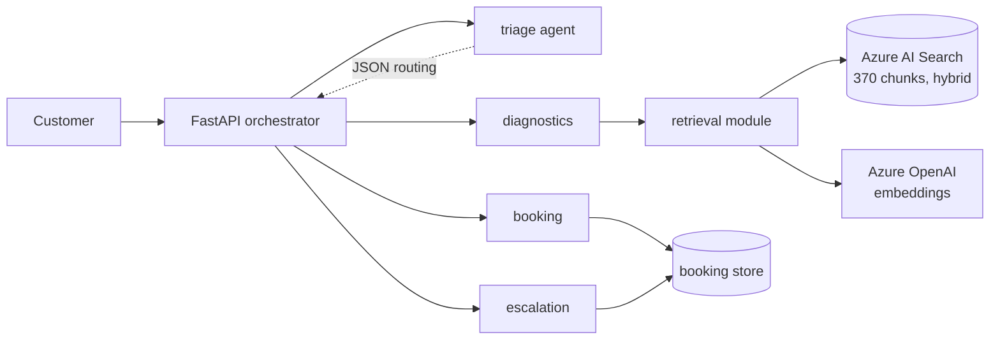

# AutoAssist

A multi-agent vehicle service assistant on Azure AI Foundry.

Ask it about a fault code and it answers from the workshop's service documents,
with citations. Ask it to book a slot and it checks real availability. Ask about
something the documents do not cover and it says so instead of guessing.

```
> P0420 is showing, can I book in for Saturday?

The P0420 fault code means the catalytic converter on bank 1 is not cleaning
the exhaust as well as it should... (fault code list, P0420)

I can help you book a slot for Saturday 19 September. Here are some available
times: 09:00, 10:30, 12:00, or 14:00. Could you please provide your vehicle
registration number?

triage → diagnostics → booking · searched documents · 7,071 tokens · 11.9s
```

> Week 3 of 3. Working: retrieval, four agents, parallel routing, HTTP API,
> chat page, container, CI, App Insights tracing, automated evals (16/16).
> Not yet: deployment pipeline, Terraform. See [Status](#status).

---

## How it works



A message goes to **triage**, which returns JSON — intents, a safety flag, any
registration or date it spotted. The orchestrator reads that and decides which
specialists to run, in what order. Each specialist runs in its own fresh thread
and their answers are joined into one reply.

**Routing is code, not an agent calling agents.** Three reasons: every decision
is a logged value rather than a hidden step inside a model; the routing logic is
unit tested without touching Azure; and the rule "a safety issue always reaches
escalation" is an `if` statement. Findings 1, 6 and 7 below are all cases of a
model dropping a safety rule under pressure from competing instructions. An `if`
statement does not do that.

There is a second safety net. Triage decides whether a message is dangerous, and
a regex checks the raw text independently. Either firing is enough. When the
regex catches something triage missed, it logs a warning — a signal the triage
prompt needs work, captured automatically.

### The agents

| Agent | Job | Tools |
|---|---|---|
| triage | Classify intent, flag safety. Returns JSON, never prose. | none |
| diagnostics | Fault codes, warning lights, maintenance intervals | `search_service_docs`, `raise_ticket` |
| booking | Find, book, cancel and confirm slots | `get_available_slots`, `book_service_slot`, `cancel_service_booking`, `look_up_booking` |
| escalation | Hand over to a human with a written summary | `raise_ticket` |

### Retrieval

Hybrid search — BM25 keyword plus vector similarity, fused by reciprocal rank
fusion — over 370 chunks: 62 OBD-II fault codes, 28 maintenance items, and 30
synthetic service bulletins.

Two things sit on top of the raw search:

**A relevance floor.** Top-k retrieval always returns k results, even when
nothing is relevant — there is no empty result. Below the floor we return
nothing at all and tell the agent the library does not cover it.

**A per-source cap.** One strongly matching document can take every slot. For
"my catalytic converter light is on", four of five results came from one
bulletin and pushed the actual P0420 definition to rank 4.

The agents do not use Azure AI Search's built-in tool. Retrieval is a **function
tool** this service executes, which is what allows the floor, the cap, and
control over how citations are worded. (It was also forced by a bug — see
finding 5.)

---

## What this is actually for

The system works, but the interesting part is
**[docs/evaluation.md](docs/evaluation.md)** — ten documented failures, what
caused each, and what fixed it. Short version:

1. **The agent skipped retrieval on safety questions.** A rule that only forbids
   leaves the model to invent its own replacement behaviour.
2. **It cited a clutch bulletin to answer a brake question.** Worse than
   answering from nothing, because it read as properly sourced.
3. **Testing several questions in one thread invalidated the results.** The
   model reused chunks already in the history instead of searching again.
4. **The portal and the repo held different prompts.** Deploying from the repo
   silently reverted a fix and produced a fabricated citation.
5. **The built-in search tool could not do vector queries here.** Which is why
   retrieval moved into this service.
6. **A safety warning vanished when two instructions overlapped.** The model
   resolved the ambiguity in the unsafe direction.
7. **A tool's output is a second prompt, and it wins.** Saying "5 relevant
   documents" when the tool only knew "5 closest text matches" overrode the
   instruction to check relevance. So did the word "complete".
8. **A missing run state caused 90-second hangs.** Azure returns `incomplete`;
   the poll loop did not know it and waited out the timeout on runs that had
   already finished. Found by an eval case about prompt injection.
9. **"I can smell petrol" did not trigger the fuel warning.** The prompt said
   "fuel leaks". Customers do not say "leak".
10. **The scorer was wrong more often than the system.** Six of the first ten
    eval failures were bugs in the eval, including checking citations against
    files on disk when the search index is the real ground truth.

Every one of those produced a plausible-looking answer. None of them looked
broken. They were found by checking whether the tool was actually called, what
the citation pointed at, and whether the test conditions were clean.

---

## Running it

### Azure resources

| Resource | Purpose | Tier |
|---|---|---|
| AI Foundry project `autoassist` | hosts the agents | — |
| `gpt-4.1-mini` | all four agents | Global Standard |
| `text-embedding-3-small` | embeddings, ingestion and query | Global Standard |
| Azure AI Search `autoassist-search` | hybrid index | **Free** |

Region: **South India**. Resource group: `Ai_solution`.

Roughly ₹600–1,000/month at light use. The Free search tier has no semantic
reranker — see [docs/decisions/004-no-semantic-ranker.md](docs/decisions/004-no-semantic-ranker.md).

### Setup

```bash
make setup
source .venv/bin/activate
cp .env.example .env        # fill in two keys
az login

make data                   # generate 30 synthetic bulletins
make reindex                # build and fill the search index
python3 agents/deploy_agents.py
```

### Use it

```bash
make serve                  # http://localhost:8000
make test                   # 112 tests, no Azure needed
make evals                  # 16 golden-set cases against the real agents

python3 agents/ask.py "what does P0420 mean"
python3 agents/ask.py "my brakes feel spongy"
python3 scripts/search_test.py "spongy brakes" --mode keyword
```

`ask.py` prints whether the agent actually searched, every tool call with its
timing, and the token count. A technical answer with `searched: NO` is
ungrounded, whatever it says.

---

## Layout

```
agents/
  definitions/*.json     agent prompts and config, version controlled
  deploy_agents.py       idempotent create-or-update in Foundry
  ask.py                 one question, one fresh thread, full trace
services/orchestrator/
  app.py                 FastAPI: /chat /health /ready /metrics
  router.py              triage parsing, routing, safety net, composition
  runner.py              run loop: poll with timeout, execute tool calls, log
  retrieval.py           hybrid search, relevance floor, per-source cap
  tools.py               tool schemas and handlers
  booking.py             slot availability, bookings, tickets
scripts/
  generate_bulletins.py  synthetic service bulletins as PDFs
  ingest.py              chunk, embed, build the index
  search_test.py         retrieval with no agent in the way
evals/golden_set.jsonl   16 test cases, several from real regressions
docs/
  evaluation.md          the seven findings
  decisions/             why things are the way they are
tests/                   50 offline tests
```

---

## About the data

Fault codes are real generic OBD-II codes — a public standard. Maintenance
intervals are typical values written by hand.

The service bulletins are **fictional**, generated by a language model for a
fictional manufacturer called **Corvale**. No real manufacturer documents are
used or redistributed. Every generated PDF says so on page 1.

---

## Status

**Working:** ingestion and hybrid retrieval · four agents deployed from version
controlled JSON · code-based routing with an independent safety check ·
independent specialists run in parallel · function tools executed in-process ·
run loop with timeouts and per-call logging · OpenTelemetry tracing into
Application Insights · FastAPI with liveness and readiness · chat page showing
the trace · Dockerfile · GitHub Actions CI · 112 offline tests · automated
eval suite scoring 16 cases on trace facts, 16/16 passing.

**Not done yet:** deployment pipeline (CI runs tests, builds the image and runs
the smoke evals; it does not deploy) · Terraform (resources were created by
hand) · model-graded evaluation (the scorer checks compliance, not quality).

**Known limitations:**

- **~12s per three-agent reply** (down from 20s). Independent specialists now
  run in parallel; see `docs/evaluation.md`. Triage is the largest remaining
  single cost at 2.8s for ~50 tokens of JSON. Streaming the first answer while
  the second works would cut perceived latency further.
- **Conversation memory is the last six turns, kept by the page.** The server
  holds no session, so any replica can answer any message; reload the page and
  the conversation is gone. Booking and escalation see the recent turns.
  Diagnostics sees only what the customer said earlier, never earlier answers,
  so every question is searched afresh (finding 3).
- **Bookings are a JSON file.** The interface is designed so Azure Table Storage
  or a real calendar drops in without touching the agents.
- **No reranker** on the Free search tier.
- **The relevance floor cannot judge topic.** It measures agreement between
  search methods, not whether a document is about the right component. A clutch
  and a brake bulletin score the same. That judgement is made by the model.
- **The search index holds an API key** for its vectorizer. Managed identity is
  the correct fix.
